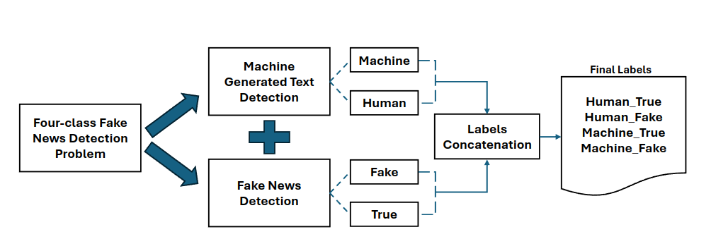

# Detection of Human and Machine-Authored Fake News in Urdu

Official implementation of **"Detection of Human and Machine-Authored Fake News in Urdu,"** published at the **63rd Annual Meeting of the Association for Computational Linguistics (ACL 2025), Main Conference (Long Papers)**.

This work introduces four-class fake news detection for Urdu by distinguishing between **human fake (HFake)**, **human true (HTrue)**, **machine fake (MFake)**, and **machine true (MTrue)** news. Four existing Urdu fake news datasets are extended with machine-generated news, and a conjoint detection strategy is proposed to decompose the four-class problem into machine-generated text detection and fake news detection.

The repository provides the four-class datasets and scripts for reproducing the Linear SVM, XLM-RoBERTa, and proposed conjoint classification experiments reported in the paper.

---

## Methodology

The study considers three approaches to four-class Urdu fake news detection:

1. **Linear SVM (LSVM)** &mdash; a traditional machine-learning baseline using TF-IDF text features.
2. **XLM-RoBERTa (XLM-R)** &mdash; direct four-class fine-tuning of `xlm-roberta-base`.
3. **Conjoint Detection** &mdash; the proposed approach decomposes the task into two binary classification problems:
   - **Machine-generated text detection:** Human vs. Machine
   - **Fake news detection:** Fake vs. True

The predictions of the two conjoint classifiers are combined to recover the original four-class labels:

```text
Human   + Fake &rarr; HFake
Human   + True &rarr; HTrue
Machine + Fake &rarr; MFake
Machine + True &rarr; MTrue
```

The proposed conjoint detection framework is illustrated below:

<p align="center">
  
</p>

<p align="center">
  <em>Proposed conjoint fake news detection architecture.</em>
</p>

---

## Repository Structure

```text
UrduHMFND2024/
├── assets/
│   └── framework.png
│
├── classification/
│   ├── train_conjoint.py
│   ├── train_lsvm.py
│   └── train_xlmr.py
│
├── Datasets/
│   ├── Ax-to-Grind/
│   │   ├── train.xlsx
│   │   └── test.xlsx
│   ├── BendtheTruth/
│   │   ├── train.xlsx
│   │   └── test.xlsx
│   ├── UFN2023/
│   │   ├── train.xlsx
│   │   └── test.xlsx
│   └── UFNAugmented/
│       ├── train.xlsx
│       └── test.xlsx
│
├── LICENSE
├── README.md
└── requirements.txt
```

---

## Installation

Clone the repository:

```bash
git clone https://github.com/zainali93/UrduHMFND2024.git
cd UrduHMFND2024
```

A Conda environment with Python 3.11 is recommended:

```bash
conda create -n urduhmfnd python=3.11
conda activate urduhmfnd
```

### PyTorch and GPU Support

Fine-tuning XLM-RoBERTa is computationally intensive, and using a CUDA-enabled GPU is strongly recommended. Install the appropriate PyTorch build for your system by following the official [PyTorch installation instructions](https://pytorch.org/get-started/locally/).

After installing PyTorch, install the remaining dependencies:

```bash
pip install -r requirements.txt
```

You can verify that PyTorch detects your GPU using:

```bash
python -c "import torch; print('CUDA available:', torch.cuda.is_available()); print('GPU:', torch.cuda.get_device_name(0) if torch.cuda.is_available() else 'None')"
```

The Hugging Face `Trainer` automatically uses an available CUDA-enabled GPU.

All commands below assume that they are executed from the root directory of the repository.

---

## Datasets

Four Urdu fake news datasets are provided under the `Datasets/` directory. Each dataset has predefined `train.xlsx` and `test.xlsx` files and contains `text` and `label` columns.

| Experiment | Directory | Original Dataset | Content | Category |
|---|---|---|---|---|
| Dataset1 | `Ax-to-Grind/` | Ax-to-Grind Urdu | Headlines | Short |
| Dataset2 | `UFN2023/` | UFN2023 | Headlines | Short |
| Dataset3 | `UFNAugmented/` | UFN Augmented Corpus | Articles | Long |
| Dataset4 | `BendtheTruth/` | Bend the Truth | Articles | Long |

Each dataset contains four labels:

- `HFake` &mdash; Human-authored fake news
- `HTrue` &mdash; Human-authored true news
- `MFake` &mdash; Machine-authored fake news
- `MTrue` &mdash; Machine-authored true news

Datasets 1 and 2 primarily contain short news texts or headlines and are categorized as **Short**, whereas Datasets 3 and 4 contain longer news articles and are categorized as **Long**.

The released test files preserve the withheld test sets used in the experimental setup. For model training, a validation subset is constructed from the remaining training data.

For further details regarding the construction, collection, machine-generated text creation, quality control, and characteristics of the datasets, please refer to the paper and the original dataset publications cited therein.

---

## Linear SVM Baseline

The traditional machine-learning baseline can be run using:

```bash
python classification/train_lsvm.py
```

Select one of the four datasets by changing `DATASET_NAME` at the beginning of the script:

```python
DATASET_NAME = "Dataset1"
```

Available options are:

```text
Dataset1
Dataset2
Dataset3
Dataset4
```

The pipeline performs traditional text preprocessing followed by TF-IDF feature extraction and Linear SVM classification. The script reports precision, recall, and F1-score for each of the four classes together with overall classification accuracy.

---

## XLM-RoBERTa Baseline

The direct four-class XLM-R baseline can be run using:

```bash
python classification/train_xlmr.py
```

Select the required experimental setting by changing `EXPERIMENT`:

```python
EXPERIMENT = "Dataset1"
```

Available settings are:

```text
Dataset1
Dataset2
Dataset3
Dataset4
Short
Long
All
```

The combined settings correspond to:

```text
Short = Dataset1 + Dataset2
Long  = Dataset3 + Dataset4
All   = Dataset1 + Dataset2 + Dataset3 + Dataset4
```

The model directly predicts one of the four labels:

```text
HFake
HTrue
MFake
MTrue
```

The script fine-tunes `xlm-roberta-base`, selects the best checkpoint using validation performance, and evaluates the resulting model on the withheld test data.

---

## Conjoint Fake News Detection

The proposed conjoint approach can be run using:

```bash
python classification/train_conjoint.py
```

As with the XLM-R baseline, select the experimental setting using:

```python
EXPERIMENT = "Dataset1"
```

Available settings are:

```text
Dataset1
Dataset2
Dataset3
Dataset4
Short
Long
All
```

Instead of directly learning the four-class problem, the conjoint method fine-tunes two independent XLM-R classifiers.

### Machine-Generated Text Detection

The first classifier determines whether the text was written by a human or generated by a machine:

```text
HFake &rarr; Human
HTrue &rarr; Human
MFake &rarr; Machine
MTrue &rarr; Machine
```

### Fake News Detection

The second classifier determines whether the news is fake or true:

```text
HFake &rarr; Fake
HTrue &rarr; True
MFake &rarr; Fake
MTrue &rarr; True
```

During inference, predictions from the two classifiers are combined and mapped back to the four original classes.

```text
Human   + Fake &rarr; HFake
Human   + True &rarr; HTrue
Machine + Fake &rarr; MFake
Machine + True &rarr; MTrue
```

The final evaluation reports precision, recall, and F1-score for each four-class label together with overall accuracy.

---

## Experimental Settings

For the XLM-R and conjoint experiments, the released scripts provide configurable training parameters at the beginning of each script.

The main XLM-R training configuration reported in the paper is:

| Parameter | Value |
|---|---|
| Base model | `xlm-roberta-base` |
| Learning rate | 2e-5 |
| Weight decay | 0.01 |
| Epochs | 10 |
| Best model loading | Enabled |

The conjoint approach uses XLM-R for both constituent binary classifiers and follows the same training configuration as the direct XLM-R baseline.

The experimental data split corresponds to approximately:

- **60% training**
- **20% validation**
- **20% testing**

The test data is withheld from model training and validation.

> **Note on reproducibility:** The released scripts provide configurable default hyperparameters. For the exact experimental settings used to obtain the results reported in the paper, please refer to the hyperparameter configurations specified in the paper.

---

## Evaluation

The classification scripts report:

- Precision
- Recall
- F1-score
- Accuracy

For the four-class experiments, class-wise results are reported for:

```text
HFake
HTrue
MFake
MTrue
```

The XLM-R and conjoint scripts support evaluation on the four individual datasets as well as the **Short**, **Long**, and **All** combined settings.

---

## Paper

The paper is available through the ACL Anthology:

[Detection of Human and Machine-Authored Fake News in Urdu](https://aclanthology.org/2025.acl-long.170/)

**Muhammad Zain Ali, Yuxia Wang, Bernhard Pfahringer, and Tony C Smith.**  
Proceedings of the 63rd Annual Meeting of the Association for Computational Linguistics (Volume 1: Long Papers), ACL 2025, pp. 3419–3428.

---

## Citation

If you use this work or the released datasets, please cite:

```bibtex
@inproceedings{ali-etal-2025-detection,
    title = "Detection of Human and Machine-Authored Fake News in {U}rdu",
    author = "Ali, Muhammad Zain and Wang, Yuxia and Pfahringer, Bernhard and Smith, Tony C",
    booktitle = "Proceedings of the 63rd Annual Meeting of the Association for Computational Linguistics (Volume 1: Long Papers)",
    month = jul,
    year = "2025",
    address = "Vienna, Austria",
    publisher = "Association for Computational Linguistics",
    url = "https://aclanthology.org/2025.acl-long.170/",
    doi = "10.18653/v1/2025.acl-long.170",
    pages = "3419--3428"
}
```

---

## License

The source code in this repository is released under the [MIT License](LICENSE).

The datasets included in this repository are derived from previously published Urdu fake news datasets and may remain subject to the licenses and usage conditions of their respective original sources.
